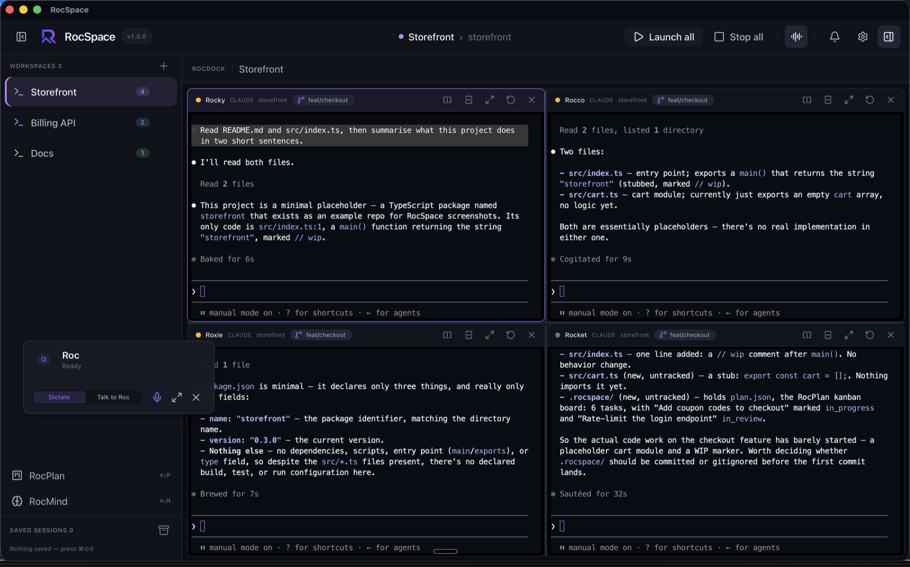
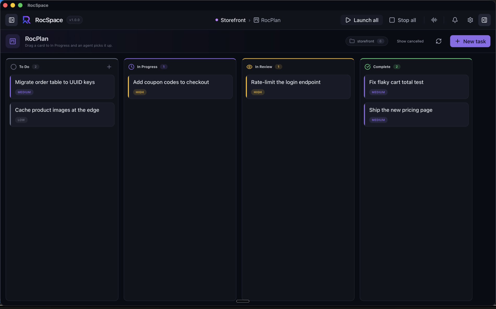
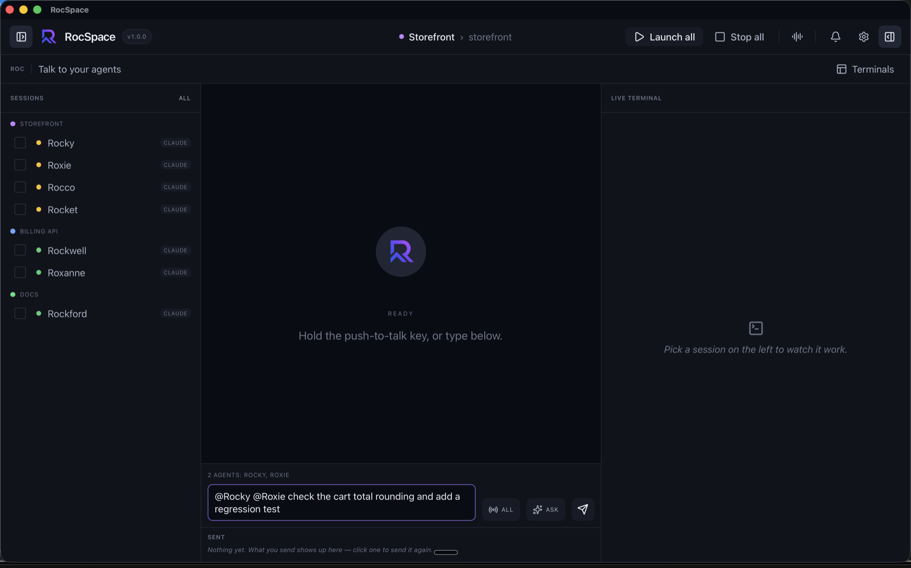
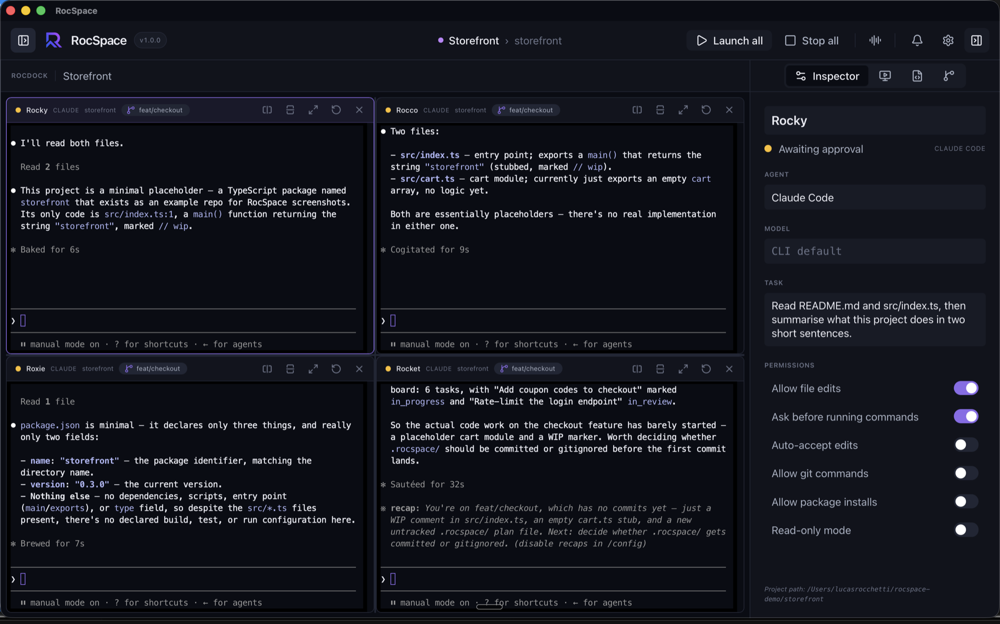
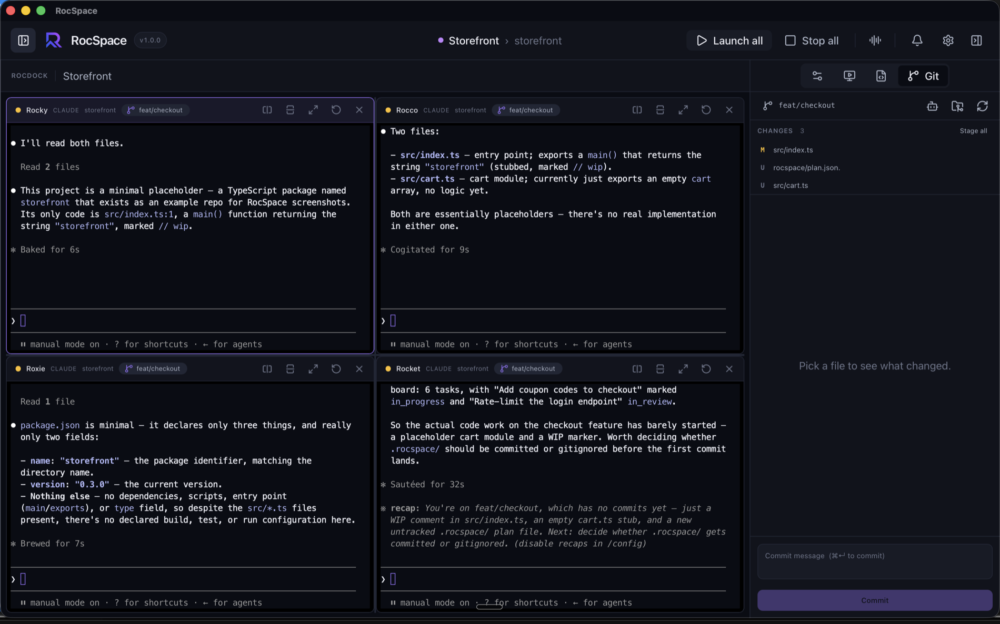
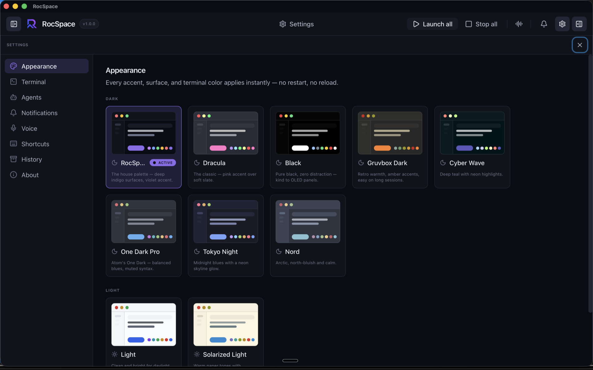

<div align="center">


# RocSpace

**Run a team of AI coding agents side by side, in one window.**

Claude Code, Codex, OpenCode or a plain shell — each in a real terminal, grouped
into workspaces, with a board they can move themselves and a voice you can talk to.

[](LICENSE)
[](CHANGELOG.md)
[](#install)
[](#how-it-works)

</div>



---

## Why

Most AI coding tools assume one agent, in one terminal, at a time. That is not how
the work actually goes. You set one agent on a refactor, hand another the test
suite, keep a shell for the dev server — and then spend the day alt-tabbing between
four windows, forgetting which one is waiting on you.

RocSpace is that window. Real PTYs, so each agent's own TUI, colours and line
editing behave exactly as they do in your terminal. Splits you drag. Workspaces
that survive a quit. And one place to see which agent is working, which is stuck,
and which just finished.

## What's inside

### Terminals, in splits

Split right with <kbd>⌘D</kbd>, down with <kbd>⌘⇧D</kbd>, up to sixteen panes per
workspace. Drag the dividers; the ratios are remembered. Every pane header carries
its name (double-click to rename — the defaults come from a pool of roc names:
Rocky, Rocco, Roxie…), the agent it runs, its working directory, and a **git branch
chip** that follows checkouts.

For Claude Code panes the status dot is *reported, not guessed*: each spawn is
handed a settings file wiring Claude's own SessionStart / Stop / Notification hooks
to a log RocSpace tails. "Running", "waiting for you" and "idle" mean what they say.

### RocPlan — a board your agents can use



A kanban board for the active project — To Do, In Progress, In Review, Complete.
It lives in `<project>/.rocspace/plan.json`, so it travels with the repo and can be
committed and reviewed like anything else.

Assign a card to a named agent and drag it into **In Progress**: RocSpace finds
that agent's pane, waits for it to go idle, and sends it a structured prompt. When
the turn ends, the card moves itself to In Review.

Agents reach the same board through **`rocspace-mcp`**, a local MCP server handed
to Claude panes automatically — so an agent can file what it discovers and move its
own card along without you touching the board.

### Roc — say it once, to everyone



One message, several agents. Targets come from `@name` tokens as you type, from
checkboxes in the session rail, or from Broadcast across the whole workspace. A
busy pane queues the message and takes it when it goes idle.

Hold the push-to-talk key anywhere on the machine and talk instead — speech is
transcribed locally by Whisper, and nothing is sent anywhere. **Ask Roc** goes one
step further: it reads your sentence, works out who should do what, and writes a
tailored prompt for each agent. Nothing reaches a terminal until you press Send.

### Agents, actually configured



Model, permissions, and the task prompt are argv, not settings a running process
can be talked into. The Inspector edits them per pane and offers the restart that
would apply them.

### Git, without leaving



Stage, unstage, diff, commit, switch branches — and create a **worktree that opens
as its own workspace**, which is how you give one agent an isolated branch to work
on. The panel keeps up with the agents beside it: it watches what `git status`
actually reads, so a commit made in a pane shows up without you asking.

### Themes



Ten themes, dark-first. Each is a single record of semantic tokens, so the
terminals, the Monaco editor and the native window frame all re-theme together,
instantly, with no reload.

### And the rest

- **Workspaces** — a project each, with their own panes and accent. <kbd>⌘T</kbd>
  to make one, <kbd>⌘1</kbd>–<kbd>⌘9</kbd> to switch. Everything is restored on
  launch, including a Claude conversation that was mid-flight when you quit.
- **Saved sessions** — <kbd>⌘⇧S</kbd> saves a whole workspace layout by name.
- **RocMind** — every memory your agents write, mirrored into a browsable tree
  organised by the project it came from. Read in place; nothing is moved.
- **An editor** — <kbd>⌘P</kbd> to open a file, <kbd>⌘S</kbd> to save.
- **<kbd>⌘K</kbd>** reaches everything.

## Install

RocSpace is source-available and builds in a few minutes. There is no published
binary yet — when one is tagged it will appear under
[Releases](https://github.com/rocchettilucas/RocSpace/releases).

### 1. Requirements

| | |
|---|---|
| **Rust** (stable) | [rustup.rs](https://rustup.rs/) |
| **Node 22** and **pnpm 10** | what CI runs |
| **CMake** | `whisper-rs` builds whisper.cpp from source |
| **libclang** | for `whisper-rs-sys`'s bindgen — see below |

On macOS, install the Xcode Command Line Tools and CMake:

```sh
xcode-select --install
brew install cmake
```

Then point bindgen at libclang. **Which path depends on what you have installed** —
bindgen does not consult `xcrun`, and it is the single most common reason a build
fails:

```sh
# Command Line Tools only (most people):
export LIBCLANG_PATH=/Library/Developer/CommandLineTools/usr/lib

# Full Xcode:
export LIBCLANG_PATH="$(xcode-select -p)/Toolchains/XcodeDefault.xctoolchain/usr/lib"
```

Without it, every `cargo` command — `cargo test` included — dies in
`whisper-rs-sys` with `Unable to find libclang`.

<details>
<summary>Windows and Linux</summary>

Windows needs LLVM and CMake (`winget install LLVM.LLVM Kitware.CMake`), plus
WebView2 (preinstalled on Windows 11); set `LIBCLANG_PATH` to LLVM's `bin`.
Windows is kept compiling but is not the development platform. **Linux is
untested** — it should work, but nobody has tried.

</details>

### 2. Get the code

```sh
git clone https://github.com/rocchettilucas/RocSpace.git
cd RocSpace
pnpm install
```

### 3. Run it

```sh
pnpm tauri:dev
```

That is the development build, with hot reload. To get an app you can keep:

```sh
pnpm tauri:build
```

This stages the `rocspace-mcp` sidecar, builds the frontend, compiles the Rust
binary, signs the bundle, and verifies the signature. It leaves you with:

```
src-tauri/target/release/bundle/macos/RocSpace.app
src-tauri/target/release/bundle/dmg/RocSpace_1.0.0_aarch64.dmg
```

Drag the `.app` into `/Applications` and it behaves like any other Mac app.

### 4. First launch

- **The bundle is ad-hoc signed, not notarized.** On the machine that built it,
  it just opens. A copy moved to another Mac arrives quarantined and needs one
  right-click → **Open** to get past Gatekeeper's unidentified-developer prompt.
- **Bring your own agents.** RocSpace runs the CLIs you already have — install
  [Claude Code](https://claude.com/claude-code), Codex or OpenCode first. It finds
  them the way your terminal does, including PATH set in `~/.zshrc`.
- **Voice is opt-in.** The first time you use dictation, RocSpace downloads a
  Whisper model (`base.en`, ~142 MB) into its app-data directory. Until then the
  microphone button is inert. Transcription runs entirely on your machine.

## Keyboard

| | |
|---|---|
| <kbd>⌘K</kbd> | Command palette — every action, by name |
| <kbd>⌘D</kbd> / <kbd>⌘⇧D</kbd> | Split the focused pane right / down |
| <kbd>⌘N</kbd> / <kbd>⌘W</kbd> | New pane / close it (confirms if it is running) |
| <kbd>⌘T</kbd> · <kbd>⌘1</kbd>–<kbd>⌘9</kbd> | New workspace · switch workspace |
| <kbd>⌘⇧S</kbd> | Save the workspace as a named session |
| <kbd>⌘⇧P</kbd> · <kbd>⌘⇧M</kbd> · <kbd>⌘⇧R</kbd> | RocPlan · RocMind · Roc |
| <kbd>⌘⇧K</kbd> | Git panel, commit box focused |
| <kbd>⌘P</kbd> · <kbd>⌘S</kbd> | Open a file by name · save it |
| <kbd>⌘+</kbd> <kbd>⌘−</kbd> <kbd>⌘0</kbd> | Zoom the interface (not the terminals) |

The full list — every chord, and exactly where it applies — is in
**Settings › Shortcuts**, and it is the whole list rather than a selection.

## How it works

Tauri 2 shell, Rust core, React 19 renderer.

- **PTYs** are real (`portable-pty`), rendered by xterm.js on WebGL with a DOM
  fallback. Output is batched per animation frame under a per-frame budget,
  focused pane first, so one loud agent cannot starve the others. Panes in
  workspaces you are not looking at keep running and keep buffering.
- **Panes are portals.** An xterm is a live view, not something reconstructible
  from bytes, so the pane tree re-parents them rather than rebuilding them — the
  reason splitting, maximizing and switching workspaces do not disturb a session.
- **Agent argv** is built in Rust (`src-tauri/src/agents/command.rs`) with every
  word POSIX-quoted, so nothing you type can be re-interpreted on the way.
- **Status comes from hooks**, not heuristics, for Claude Code panes.
- **`rocspace-mcp`** is a second binary shipped inside the bundle and handed to
  agents over stdio.

Deeper notes live in [`docs/user-guide.md`](docs/user-guide.md); the release
history is in [`CHANGELOG.md`](CHANGELOG.md).

## Development

```sh
pnpm typecheck                 # tsc --noEmit
pnpm lint                      # eslint --max-warnings 0 && prettier --check
pnpm test                      # vitest, single run

cargo test   --manifest-path src-tauri/Cargo.toml
cargo clippy --manifest-path src-tauri/Cargo.toml --all-targets -- -D warnings
```

CI runs all of it on macOS, plus a build of the sidecar. 1.0.0 ships with 1,852
frontend tests and 499 Rust tests green.

```
src/                 React renderer — views, stores, lib
src-tauri/src/       Rust core — pty, agents, git, roctalk, roc_brain, mcp
docs/                user guide and images
```

## Licence

MIT — see [LICENSE](LICENSE).

<div align="center">
<sub>Screenshots show example projects, not real ones.</sub>
</div>
